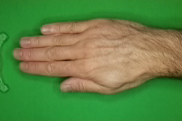
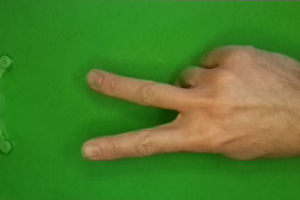
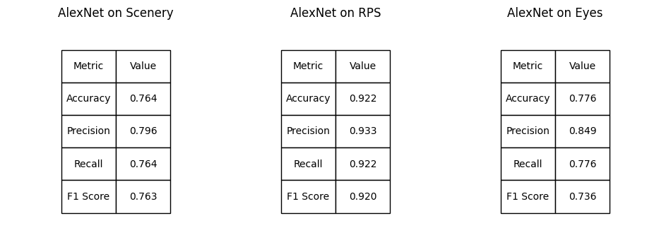
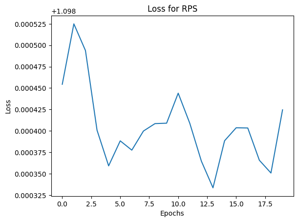
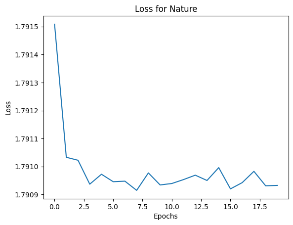
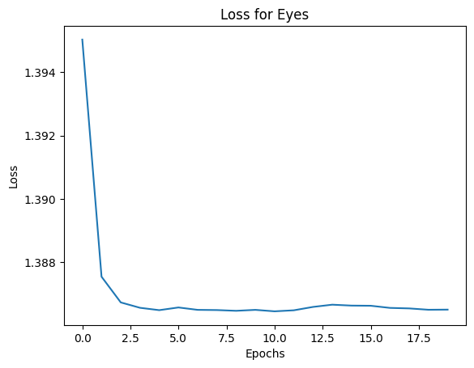
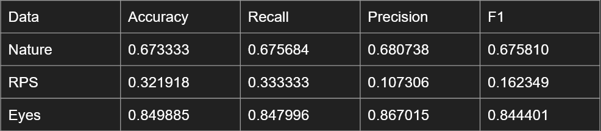
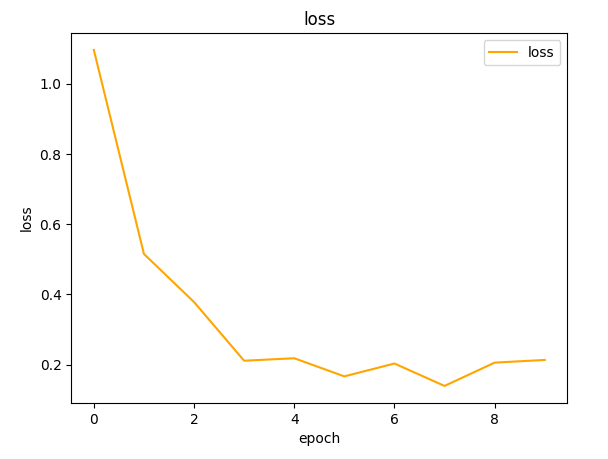
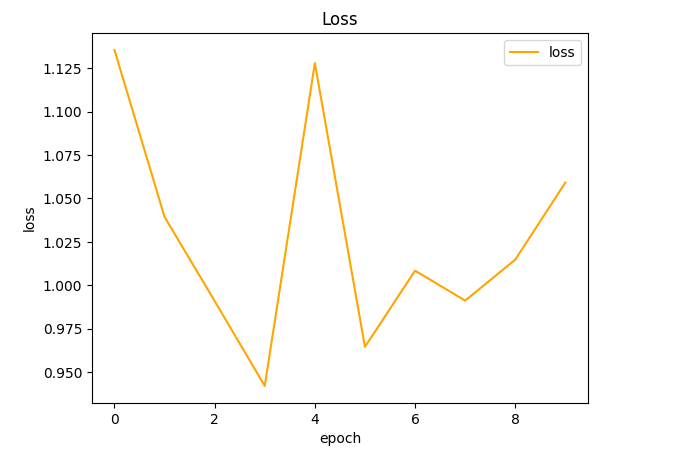
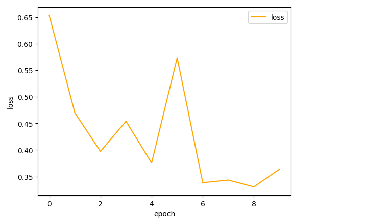

# Image Classification using Various CNNs
### Authors: Justin Pham, John Aguinaga, Jason Bard, Bavithra Lakshmanasamy

This repository holds an attempt to use multiple CNNs on multiple image datasets in order to successfully classify them.

## Overview

Our group tested four separate CNN architectures on three separate datasets. This includes a rock-paper-scissors (RPS) dataset, a natural scenery (Nature/Scenery) dataset, and a Driver Drowsiness Detection (Eyes) dataset, all freely available on Kaggle. Our architectures include one based on VGGNet, one based one AlexNet, one based on Dense121, and a custom architecture.

## Summary of Work Done

### Data

* Scenery Dataset:
  * Type: Image Data
    * Input: Scenery images (150x150 pixel jpges) 6 types of scenery: "Buildings", "Forest", "Glacier","Mountain","Sea" and "Street"
    * Input: Training/Testing Images, output: Training/Testing Labels.
  * Size: 399 MB total.
  * Instances: (Train, Test, Prediction split): Train: 14,000 images, Test: 3000 images, Prediction: 7300 images.
    * Prediction images did not have labels.
  * Available on [Kaggle](https://www.kaggle.com/datasets/puneet6060/intel-image-classification).
  
* Rock-Paper-Scissors (RPS) Dataset:
  * 2188 images of individual hand signals against a green background
    * 726 Rocks, 710 Papers, 752 Scissors
  * Stored in PNG format (200 x 300)
  * Data size: 160 MB
    * Images are included twice, leading to a true size of 321 MB.
  * Available on [Kaggle](https://www.kaggle.com/datasets/drgfreeman/rockpaperscissors).
  
* Eyes Dataset:
  * The dataset contains 2467 images of human faces that depict different eye states (open or closed) and yawning behavior (yawning or not yawning).
  * Input: Images with eyes category (open, closed, yawn, no_yawn).
  * Output: Training/Testing Lables
  * Stored in JPG format (224 x 224)
  * Data size: 169 MB
  * Available on [Kaggle](https://www.kaggle.com/datasets/serenaraju/yawn-eye-dataset-new)

#### Preprocessing / Clean up

Image processing methods are stored in the [`datasetload`](notebooks/datasetload.py) module.

* Scenery Dataset:
  * For the scenery dataset, the images were all of size 150x150 so in order to use with AlexNet architecture they had to be resized to 227x227 for proper usage. 
  * The libraries predominantly used for resizing were `Pandas` and `os`. Used file paths to iterate through folders in Google Drive, resized the image   using `os` and uploaded the images into lists. 
  * After shuffling, normalizing and one-hot encoding, the lists were converted into arrays for the Machine Learning algorithm.
  
* RPS Dataset:
  * Images did not have to be resized since they were all 200x300. Instead, the neural network architecture shifted to allow for these to slot perfectly into the input layer.
  * The main library used for opening the images with `PIL`. The images were shuffled, normalized, and split into training and testing sets..
  
* Eyes Dataset:
  * As the images in the dataset were of varying sizes without any standard dimensions, they were resized to 224x224 to ensure compatibility with the Densenet model.
  * The data was pre-processed using libraries like openCV and Pandas. The pixel values were normalized and the labels were one-hot encoded. 
   
#### Data Visualization

Show a few visualization of the data and say a few words about what you see.

* Scenery Dataset:  
  * Picture randomly chosen from training dataset after one-hot encoding:  
   
   
* RPS Dataset:

From left to right: Rock, Paper, Scissors.

  

* Eyes Dataset:
  * Loaded pictures from Training dataset
  
  

     
### Problem Formulation

#### Datasets

* Scenery Dataset:
  * Input: Images of scenery 227x227 pixels (jpg).
  * Output: Classification one-hot label
  
* RPS Dataset:
  * Input: Images of rock-paper-scissors 200x300 pixels (png)
  * Output: Classification one-hot label
  
* Eyes Dataset:
  * Input: Images of Eyes 224x224 pixels (jpg)
  * Output: Classification one- hot label

Model architectures are also stored in the `datasetload` module, although they were copied and tweaked in the individual notebooks as well.

#### Models

* AlexNet: A convolutional neural network containing eight layers; the first five are convolutional layers, some of them followed by max-pooling layers, and the last three were fully connected layers. 
   * Loss: Categorical_Crossentropy
   * Optimizer: Adam
   * Other hyperparameters: Learning rate = 0.001, Dropout = 0.5
   * Training: The model was created using Keras and was made Sequentially. Then it was instantiated and trained via Google Colaboratory. The training took 5    minutes per dataset, with 30 epochs and a batch size of 64.
     
* VGGNet: Contains five blocks of convolutions separated by max-pooling, followed by a seven-layered DNN.
  * Loss: Categorical Cross-entropy
  * Optimizer: Adam
  * Hyperparameters: Learning rate = 0.001
  * Training: The model was created Sequentially through keras. It was training in Google Colab. Data loading and training took 15 minutes for each model, with 20 epochs.
  
* DenseNET121: Convolutions seperated by Average pooling, followed by four dense blocks where inputs are passed on to and concatenated to pass on to the next block
  * Loss: Categorical Cross-entropy
  * Optimizer: Adam
  * Hyperparameters: Learning rate = 0.001
  * Training: The model was constructed using Keras' Functional API and trained on Google Colab. Each model took approximately 15-20 minutes to train, with 30 epochs being used.
  
* Custom Arch: Contains two blocks of convolutions seperated by max-pooling, followed by two-layered DNN. 
  * Loss: Categorical Cross-entropy
  * Optimizer: Adam
  * Hyperparameters: Learning rate = 0.001, Dropout = 0.4
  * Training: The model was created Sequentially through keras. It was training in Google Colab. Data loading and training took 4 minutes for each model, with 10 epochs and a batch size of 16. 
 
### Performance Comparison

#### AlexNet

    
    
      
     

#### VGGNet

| Dataset          |  Accuracy  |   Precision |   Recall |       F1 |
|:----------------:|:----------:|:-----------:|:--------:|:--------:|
| RPS              |   0.337386 |    0.113829 | 0.337386 | 0.170227 |
| Nature / Scenery |   0.175000 |    0.030625 | 0.175000 | 0.052128 |
| Eyes             |   0.251732 |    0.063369 | 0.251732 | 0.10125  |

  

#### DenseNet121

#### Custom Arch

  

### Conclusions

* State any conclusions you can infer from your work. Example: LSTM work better than GRU.

### Future Work

* What would be the next thing that you would try.
* What are some other studies that can be done starting from here.

## How to reproduce results

* In this section, provide instructions at least one of the following:
   * Reproduce your results fully, including training.
   * Apply this package to other data. For example, how to use the model you trained.
   * Use this package to perform their own study.
* Also describe what resources to use for this package, if appropirate. For example, point them to Collab and TPUs.

### Overview of files in repository

* Describe the directory structure, if any.
* List all relavent files and describe their role in the package.
* An example:
  * utils.py: various functions that are used in cleaning and visualizing data.
  * preprocess.ipynb: Takes input data in CSV and writes out data frame after cleanup.
  * visualization.ipynb: Creates various visualizations of the data.
  * models.py: Contains functions that build the various models.
  * training-model-1.ipynb: Trains the first model and saves model during training.
  * training-model-2.ipynb: Trains the second model and saves model during training.
  * training-model-3.ipynb: Trains the third model and saves model during training.
  * performance.ipynb: loads multiple trained models and compares results.
  * inference.ipynb: loads a trained model and applies it to test data to create kaggle submission.

* Note that all of these notebooks should contain enough text for someone to understand what is happening.

### Software Setup
* List all of the required packages.
* If not standard, provide or point to instruction for installing the packages.
* Describe how to install your package.

### Data

* Point to where they can download the data.
* Lead them through preprocessing steps, if necessary.

### Training

* Describe how to train the model

#### Performance Evaluation

* Describe how to run the performance evaluation.

## Citations

* Provide any references.

