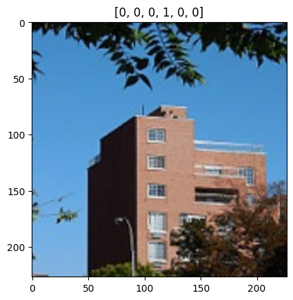

# Project Title

* **One Sentence Summary** Ex: This repository holds an attempt to apply LSTMs to Stock Market using data from
"Get Rich" Kaggle challenge (provide link). 

## Overview

* This section could contain a short paragraph which include the following:
  * **Definition of the tasks / challenge**  Ex: The task, as defined by the Kaggle challenge is to use a time series of 12 features, sampled daily for 1 month, to predict the next day's price of a stock.
  * **Your approach** Ex: The approach in this repository formulates the problem as regression task, using deep recurrent neural networks as the model with the full time series of features as input. We compared the performance of 3 different network architectures.
  * **Summary of the performance achieved** Ex: Our best model was able to predict the next day stock price within 23%, 90% of the time. At the time of writing, the best performance on Kaggle of this metric is 18%.

## Summary of Workdone

Include only the sections that are relevant an appropriate.

### Data

* Data:
  * Type: For example
    * Input: medical images (1000x1000 pixel jpegs), CSV file: image filename -> diagnosis
    * Input: CSV file of features, output: signal/background flag in 1st column.
  * Size: How much data?
  * Instances (Train, Test, Validation Split): how many data points? Ex: 1000 patients for training, 200 for testing, none for validation

* Scenery Dataset:
  * Type: Image Data
    * Input: Scenery images (150x150 pixel jpges) 6 types of scenery: "Buildings", "Forest", "Glacier","Mountain","Sea" and "Street"
    * Input: Training/Testing Images, output: Training/Testing Labels.
  * Size: 399 MB total.
  * Instances: (Train, Test, Prediction split): Train: 14,000 images, Test: 3000 images, Prediction: 7300 images. 

#### Preprocessing / Clean up

* Describe any manipulations you performed to the data.

* Scenery Dataset:
  * For the scenery dataset, the images were all of size 150x150 so in order to use with AlexNet architecture they had to be resized to 227x227 for proper usage. 
  * The libraries predominantly used for resizing were *Pandas* and *os*. Used file paths to iterate through folders in Google Colaboratory drive, resized the image   using *os* and uploaded the images into lists. 
  * After shuffling, normalizing and one-hot encoding, the lists were converted into arrays for the Machine Learning algorithm.
   
#### Data Visualization

Show a few visualization of the data and say a few words about what you see.

* Scenery Dataset:  
  * Picture randomly chosen from training dataset after one-hot encoding:  
   
  
### Problem Formulation
* Scenery Dataset:
  * Input: Images of scenery 227x227 pixels (jpg).
  * Output: Truth label
  * Models:

    AlexNet:
      * A convolutional neural network containing eight layers; the first five are convolutional layers, some of them followed by max-pooling layers, and the last             three were fully connected layers.  

        * Loss: Categorical_Crossentropy
        * Optimizer: Adam
        * Other hyperparameters: Learning rate = 0.001, Dropout = 0.5
        * Training: The model was created using Keras and was made Sequentially. Then it was instantiated and trained via Google Colaboratory. The training took 5 minutes per dataset, with 30 epochs and a batch size of 64.  
        * 

  
  
### Training

* Describe the training:
  * How you trained: software and hardware.
  * How did training take.
  * Training curves (loss vs epoch for test/train).
  * How did you decide to stop training.
  * Any difficulties? How did you resolve them?

### Performance Comparison

* Clearly define the key performance metric(s).
* Show/compare results in one table.
* Show one (or few) visualization(s) of results, for example ROC curves.

### Conclusions

* State any conclusions you can infer from your work. Example: LSTM work better than GRU.

### Future Work

* What would be the next thing that you would try.
* What are some other studies that can be done starting from here.

## How to reproduce results

* In this section, provide instructions at least one of the following:
   * Reproduce your results fully, including training.
   * Apply this package to other data. For example, how to use the model you trained.
   * Use this package to perform their own study.
* Also describe what resources to use for this package, if appropirate. For example, point them to Collab and TPUs.

### Overview of files in repository

* Describe the directory structure, if any.
* List all relavent files and describe their role in the package.
* An example:
  * utils.py: various functions that are used in cleaning and visualizing data.
  * preprocess.ipynb: Takes input data in CSV and writes out data frame after cleanup.
  * visualization.ipynb: Creates various visualizations of the data.
  * models.py: Contains functions that build the various models.
  * training-model-1.ipynb: Trains the first model and saves model during training.
  * training-model-2.ipynb: Trains the second model and saves model during training.
  * training-model-3.ipynb: Trains the third model and saves model during training.
  * performance.ipynb: loads multiple trained models and compares results.
  * inference.ipynb: loads a trained model and applies it to test data to create kaggle submission.

* Note that all of these notebooks should contain enough text for someone to understand what is happening.

### Software Setup
* List all of the required packages.
* If not standard, provide or point to instruction for installing the packages.
* Describe how to install your package.

### Data

* Point to where they can download the data.
* Lead them through preprocessing steps, if necessary.

### Training

* Describe how to train the model

#### Performance Evaluation

* Describe how to run the performance evaluation.

## Citations

* Provide any references.

